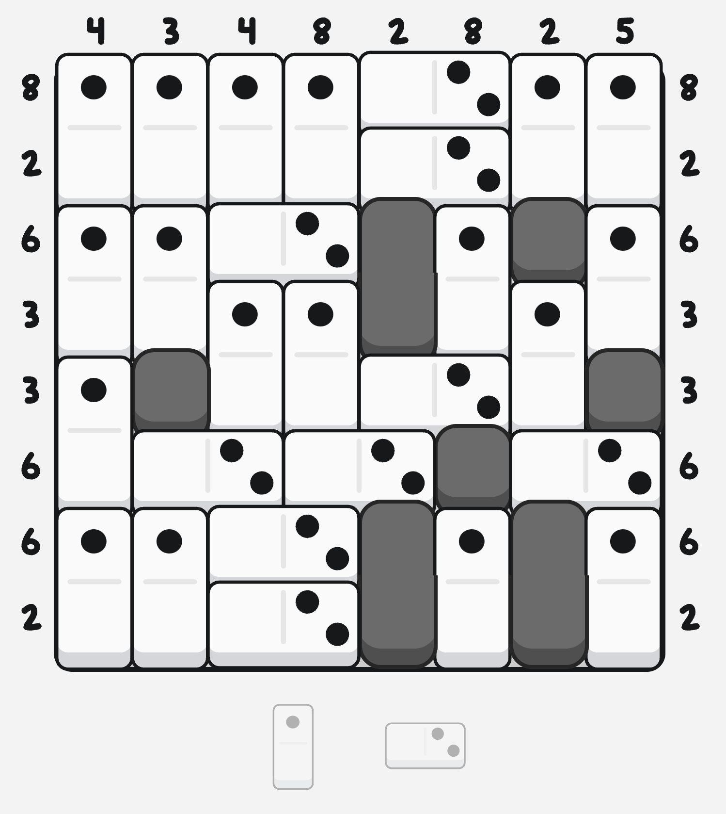
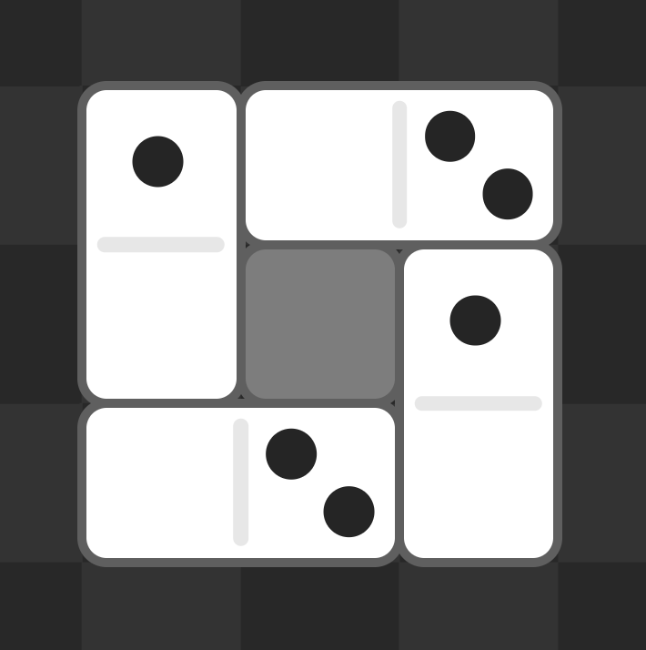
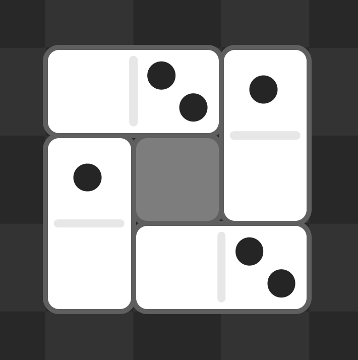
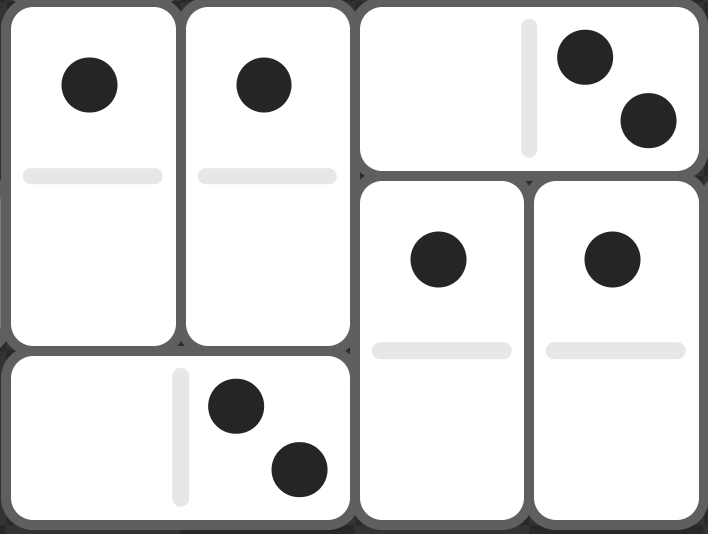
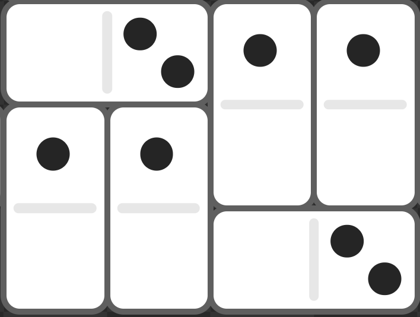
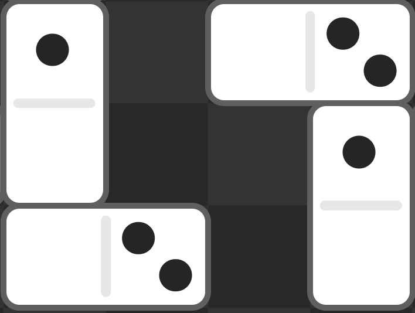

### Contents

## Domino Fit?

Domino Fit is an addictive browser-based puzzle game that you can play
[right now](https://dominofit.isotropic.us) where you tile dominos on this
$n \times n$ grid (that may have blockers) with two fixed (non-rotatable)
dominos that have specific pip-values.

The idea is that you should be able to tile the board and satisfy the pip sums
on the rows and columns given to you using the two famous dominos, the one pip
and two pip domino, which are the only pieces in the game.

What led me here was that I wanted to try my hand at making my own clone of this
game, partly because I wanted to play more Domino Fit (before the
[Steam game](https://store.steampowered.com/app/2894560/Domino_Fit/) with a
bunch of levels was released) and partly to see how making a clone would go.

It is stated by the game's creator that there is only one solution per board, so
I got curious how the boards are generated. According to the game's creator, the
boards are generated by brute force and $7 \times 7$ takes $25\text{ms}$ to
generate.

Now, the fact that there is only one solution to each board is actually super
important, as when I first released [dominogod](https://dominogod.kunet.dev),
the board generator was a naïve "place dominos down randomly" generator and
pretty frequently would generate puzzles with two solutions.

These two solution puzzles felt less satisfying to solve as they made it
easier/harder and removed a bit of the deduction involved in solving the puzzle,
so I began to seek out a solution to eliminate multiple-solution boards.

## How it feels to have two solutions

The boards that most obviously had two solutions were boards that had a "ring"
structure like this:

When you see this structure, after a few games you might come to realize that an
exactly equivalent solution is:

The row sums, `[3, 1, 2]` and column sums, `[1, 2, 3]` are both the same, and
they could both fit into the same shape. Given those two conditions, it would
make sense why both are considered valid solutions, along with why they
absolutely ruin the game.

There are also "other shapes" which at first glance seemed like different
structures entirely, but in actuality were all rings along:

This structure is equivalent to:

Notice even though the middle parts have shifted a bit, they're still the same
value. Heck, we can even straight up ignore the middle part and what do we have?

So really, so long as it takes up the same shape and the same values it is a
"ring," and to put it bluntly just randomly placing dominos creates a lot of
rings.

## Identifying rings

Identifying a ring is actually quite simple. I made it harder on myself at the
beginning by thinking of the board as a board of edges with the values of the
one or two domino. Don't make the same mistake that I did! Instead, represent
the board as so:

$$
\def\arraystretch{1.5}
  \begin{array}{c:c:c:c:c}
  t & \cdots & \cdots & tt' & tt \\ \hdashline
  t' & & & & \vdots \\ \hdashline
  \vdots & & & & \vdots \\ \hdashline
  \vdots & & & & t \\ \hdashline
  tt' & tt & \cdots & \cdots & t' \\
  \end{array}
$$

| Symbol | Value | Definition                        |
| ------ | ----- | --------------------------------- |
| $t$    | $1$   | The top half of the one domino    |
| $t'$   | $0$   | The bottom half of the one domino |
| $tt$   | $2$   | The right half of the two domino  |
| $tt'$  | $0$   | The left half of the two domino   |

> The reason why I chose $t$ and $tt$ is because when I'm drawing them on graph
> paper, it's easier to just draw a T with the number of lines going through it
> that shows its value.

Here are the previous rings with $1 \times 1$ holes as shown in this form:

| t-dom                                                                                                                          | tt-dom                                                                                                                         |
| ------------------------------------------------------------------------------------------------------------------------------ | ------------------------------------------------------------------------------------------------------------------------------ |
| $ \def\arraystretch{1.5} \begin{array}{c:c:c} t & tt' & tt \\ \hdashline t' & & t \\ \hdashline tt' & tt & t' \\ \end{array} $ | $ \def\arraystretch{1.5} \begin{array}{c:c:c} tt' & tt & t \\ \hdashline t & & t' \\ \hdashline t' & tt' & tt \\ \end{array} $ |

Now, we can start to match the pattern! We just have to be mindful of how the
ring may grow up/down and left/right. Here's what happens if we just keep the
corners around.

| t-dom                                              | tt-dom                                             |
| -------------------------------------------------- | -------------------------------------------------- |
| $ \begin{matrix} t & tt \\ tt' & t' \end{matrix} $ | $ \begin{matrix} tt' & t \\ t' & tt \end{matrix} $ |

The pattern is simply: all opposite corners are opposite "signs" (whether they
have value or not) and the adjacent corners are oriented the other way. If these
two constraints are met in a rectangular shape, then you might have[^1] an
equivalent value ring!

Remember, that when there is equivalent value in the same shape that means that
there are multiple solutions, so if we eliminate all these ring shapes, it
should remove all possible ways to have multiple solutions, as having a same
shape same value structure implies some sort of ring.

## Implementation

To put it into dominogod, I implemented it as a little WASM bundle in one of my
favorite programming languages, Zig. WASM felt like the right choice here since
I didn't want to mess with JS' famously confusing integer operations, and Zig
was right because it is easy to make working code with less dependencies.

You can find the implementation for the algorithm
[here](https://github.com/imkunet/dominogod/tree/main/generator) as well as a
testing script and benchmarking script, you just need the Zig compiler and
nothing else to get it working!

I've loosely "benchmarked" the times it takes for the algorithm to run at
different board sizes:

| Board size | Time        |
| ---------- | ----------- |
| 6          | 0.03674ms   |
| 7          | 0.11604ms   |
| 8          | 0.24996ms   |
| 10         | 0.90682ms   |
| 12         | 2.32984ms   |
| 16         | 12.46342ms  |
| 20         | 49.69018ms  |
| 32         | 926.825ms   |
| 48         | 13173.302ms |

Plotting the times looks something
[like this](https://www.desmos.com/calculator/z6kuwgxafe).

  Visiting the graph link requires JavaScript to work.

<iframe
  src="https://www.desmos.com/calculator/z6kuwgxafe?embed"
  style="border: 1px solid #ccc"
  frameborder="0"
  class="w-7/8 noscript:hidden mx-auto h-96 rounded"
></iframe>

This isn't really useful information, but is pretty cool to look at.

To sort of "prove" my solution;
[`verifier.zig`](https://github.com/imkunet/dominogod/blob/main/generator/verifier.zig)
has out code that lets you search dumbly for one of the most common ring
patterns really quickly over multiple threads and stops if it finds it. Over 18
million $8 \times 8$ board seeds have been searched for the most common ring, so
I think it seems to work!

At the very least, if I missed something you'll have at least less than a
$0.000005\%$ chance of encountering the most common ring. Not terrible odds. Win
a lottery instead.

## Acknowledgements

Thank you to [macromaniac](https://news.ycombinator.com/item?id=39420966), the
creator of Domino Fit for allowing his game to be remade. He has given his
explicit blessing for dominogod to be created, and for that I am immensely
grateful. You can support Domino Fit directly by buying the
[Steam game](https://store.steampowered.com/app/2894560/Domino_Fit/).

Also thanks Ryan for pointing out how there were duplicate solutions in
production, and pushing me to make the verifier.

[^1]:
    You might actually not have an equivalent value ring (false positive because
    there are ways to disrupt the ring with blockers in the folds), but you'll
    at least know that there is a chance there _is highly likely_ one. It is
    always better to eliminate what might become an equivalent value ring than
    to allow a potentially duplicate solution.
